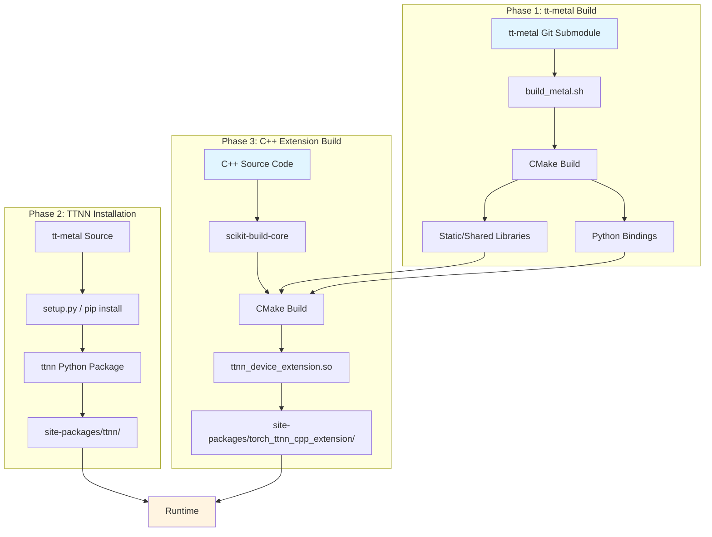
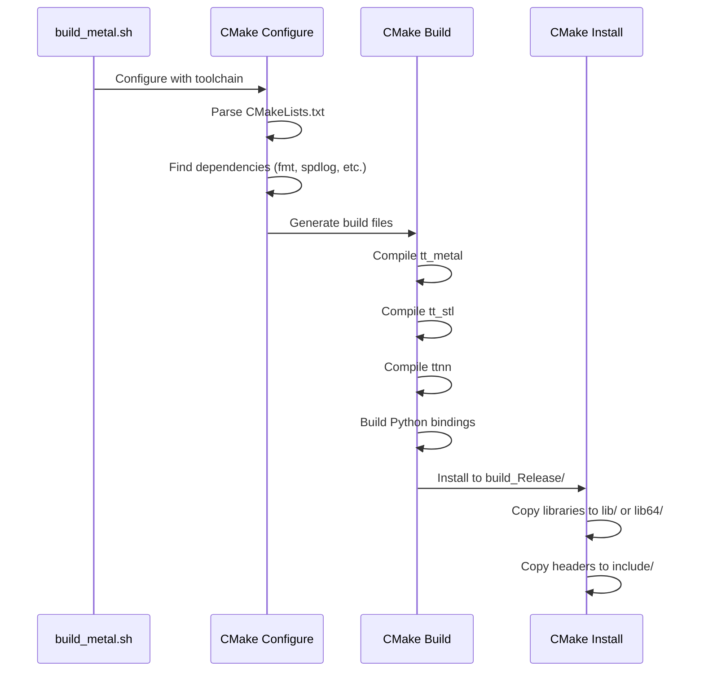
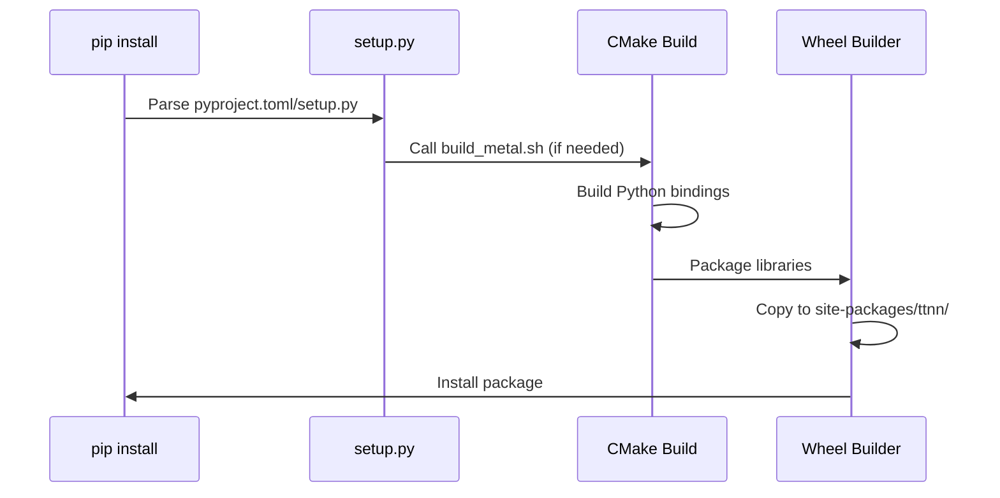
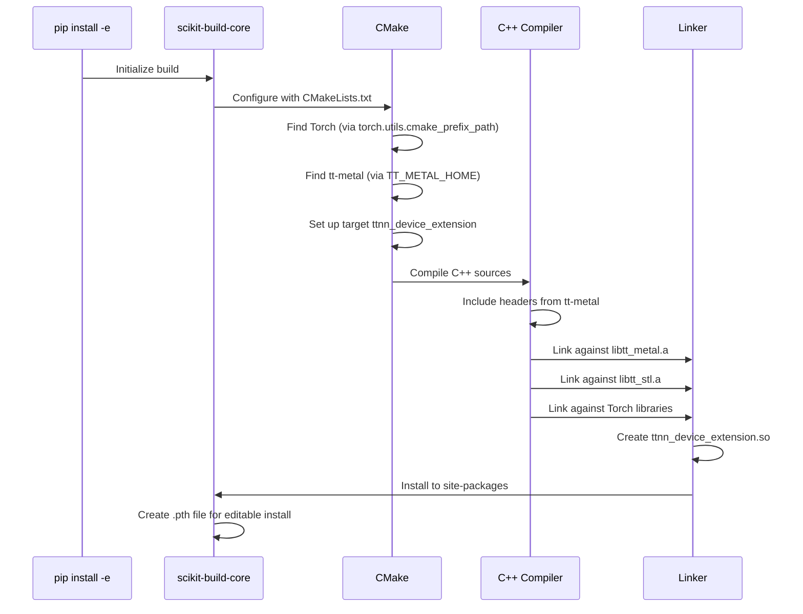
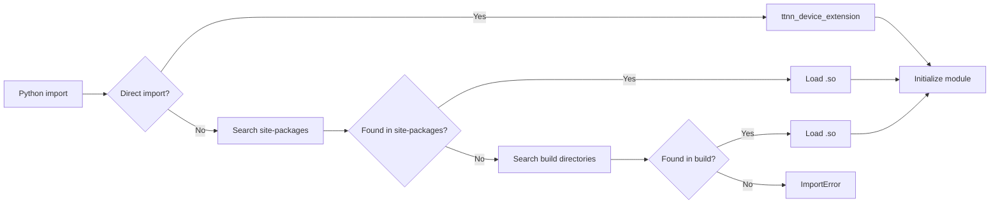

# PyTorch TTNN Build Process Documentation

## Overview

This document describes the complete build process for PyTorch TTNN, including all dependencies, build artifacts, and their locations.

## Build Architecture



## Detailed Build Flow

### Phase 1: tt-metal Build

**Input:**
- Git submodule: `torch_ttnn/cpp_extension/third-party/tt-metal/`
- Toolchain: `cmake/x86_64-linux-clang-17-*.cmake`

**Build Command:**
```bash
cd third-party/tt-metal
./build_metal.sh --build-type Release --build-static-libs --enable-ccache
```

**Process:**


**Artifacts Produced:**

| Artifact | Location | Type | Purpose |
|----------|----------|------|---------|
| `libtt_metal.a` | `build_Release/lib/` | Static library | Core metal operations |
| `libtt_metal.so` | `build_Release/lib/` | Shared library | (if shared build) |
| `libtt_stl.a` | `build_Release/lib/` | Static library | STL utilities |
| `libtt_stl.so` | `build_Release/lib/` | Shared library | (if shared build) |
| `_ttnncpp.so` | `build_Release/lib/` | Python extension | TTNN C++ bindings |
| `_ttnn.so` | `build_Release/lib/` | Python extension | TTNN Python API |
| Headers | `build_Release/include/` | C++ headers | API definitions |

**Key CMake Variables:**
- `CMAKE_BUILD_TYPE=Release`
- `CMAKE_INSTALL_PREFIX=build_Release`
- `CMAKE_INSTALL_LIBDIR=lib` or `lib64` (based on system)
- `WITH_PYTHON_BINDINGS=ON`
- `VERSION_NUMERIC=<version>` (from git tags)

### Phase 2: TTNN Installation

**Input:**
- tt-metal source directory with built artifacts
- Python environment (venv or system)

**Install Command:**
```bash
cd third-party/tt-metal
pip install --no-build-isolation .
```

**Process:**


**Installation Locations:**

| Component | Installation Path | Notes |
|-----------|-------------------|-------|
| Python package | `site-packages/ttnn/` | Main package |
| `_ttnn.so` | `site-packages/ttnn/_ttnn.so` | Python extension |
| `_ttnncpp.so` | `site-packages/ttnn/build/lib/_ttnncpp.so` | C++ bindings |
| `libtt_metal.so` | `site-packages/ttnn/build/lib/libtt_metal.so` | (if shared) |
| `libtt_stl.so` | `site-packages/ttnn/build/lib/libtt_stl.so` | (if shared) |

**setup.py Behavior:**
- `get_lib_dir()` returns `lib64` if `/usr/lib64` exists, else `lib`
- Libraries copied from `build_Release/{lib,lib64}/` to wheel
- Wheel installed to `site-packages/ttnn/`

### Phase 3: C++ Extension Build

**Input:**
- C++ source: `torch_ttnn/cpp_extension/ttnn_cpp_extension/`
- tt-metal libraries (from Phase 1)
- PyTorch CMake config

**Build Command:**
```bash
cd torch_ttnn/cpp_extension
pip install -e . --use-pep517 --no-build-isolation
```

**Process:**


**CMake Configuration:**

```cmake
# From CMakeLists.txt
project(ttnn_device_extension CXX)

# Find dependencies
find_package(Torch REQUIRED)
find_package(Python3 REQUIRED COMPONENTS Interpreter Development)

# Create target
add_library(ttnn_device_extension SHARED ${SOURCES})

# Link against tt-metal
target_link_libraries(ttnn_device_extension PUBLIC
    TT::Metalium
    TTNN::CPP
)

# Install
install(TARGETS ttnn_device_extension
    LIBRARY DESTINATION "${SKBUILD_PLATLIB_DIR}/torch_ttnn_cpp_extension"
)
```

**Artifacts Produced:**

| Artifact | Build Location | Install Location | Type |
|----------|----------------|------------------|------|
| `ttnn_device_extension.so` | `build/lib.*/torch_ttnn_cpp_extension/` | `site-packages/torch_ttnn_cpp_extension/` | Python extension |
| `libtt_metal.so` | Copied from `TT_METAL_HOME/build_Release/lib/` | `site-packages/torch_ttnn_cpp_extension/` | Shared library (if exists) |
| `libtt_stl.so` | Copied from `TT_METAL_HOME/build_Release/lib/` | `site-packages/torch_ttnn_cpp_extension/` | Shared library (if exists) |

**scikit-build-core Behavior:**

1. **Editable Install (`pip install -e`):**
   - Builds library in `build/` directory
   - Installs `.so` file to `site-packages/torch_ttnn_cpp_extension/`
   - Creates `.pth` file pointing to source directory
   - Python imports check `site-packages` first, then source

2. **Regular Install (`pip install`):**
   - Builds library in temporary directory
   - Packages into wheel
   - Installs wheel to `site-packages/`
   - All files in `site-packages/torch_ttnn_cpp_extension/`

**SKBUILD_PLATLIB_DIR:**
- Defined by scikit-build-core
- Typically: `site-packages/torch_ttnn_cpp_extension/`
- Platform-specific (e.g., `lib.linux-x86_64-cpython-310/` during build)

## Runtime Library Resolution

### Import Process



### Library Search Order

1. **Direct import** (`import ttnn_device_extension`)
   - Python's standard import mechanism
   - Checks `sys.path` directories

2. **site-packages search** (fallback)
   - `site-packages/torch_ttnn_cpp_extension/ttnn_device_extension`
   - Used by `__init__.py` and `ttnn_device_mode.py`

3. **Build directory search** (development)
   - `build/lib.*/torch_ttnn_cpp_extension/ttnn_device_extension`
   - For editable installs during development

### Shared Library Dependencies

When `ttnn_device_extension.so` loads, it needs:

1. **tt-metal libraries** (bundled in package):
   - `libtt_metal.so` - copied to `site-packages/torch_ttnn_cpp_extension/`
   - `libtt_stl.so` - copied to `site-packages/torch_ttnn_cpp_extension/`
   - Located via `INSTALL_RPATH "$ORIGIN"` (same directory as extension)
   - **No LD_LIBRARY_PATH needed**

2. **MPI libraries** (if distributed functionality used):
   - `/opt/openmpi-v5.0.7-ulfm/lib/libmpi.so.40`
   - ULFM MPI extensions
   - Only needed if distributed tests/features are enabled
   - Would require `LD_LIBRARY_PATH` if used (currently not needed for basic tests)

3. **PyTorch libraries**:
   - `libtorch.so`, `libtorch_python.so`
   - Found via PyTorch's installation (standard paths)

4. **System libraries**:
   - `libc.so`, `libstdc++.so`, `libm.so`
   - Standard system paths

## Problem Analysis: Library Packaging Solution

### Issue Found: libtt_metal.so not available at runtime

**Root Cause:**
`ttnn_device_extension.so` requires `libtt_metal.so` and `libtt_stl.so` at runtime, but these libraries were not bundled with the extension package. This required manual `LD_LIBRARY_PATH` setup in CI/test scripts, which was error-prone and fragile.

**Solution Applied:**

**Copy shared libraries to package** (final solution):
Modified `CMakeLists.txt` to automatically copy `libtt_metal.so` and `libtt_stl.so` from tt-metal build directory to `site-packages/torch_ttnn_cpp_extension/` during installation. This makes the package self-contained:
```cmake
# Copy shared libraries even with static linking
if(EXISTS "${TT_METAL_HOME}/build_Release/lib/libtt_metal.so")
    install(FILES "${TT_METAL_HOME}/build_Release/lib/libtt_metal.so"
            DESTINATION "${SKBUILD_PLATLIB_DIR}/torch_ttnn_cpp_extension"
            OPTIONAL)
endif()
```

**How it works:**
- Libraries are copied to the same directory as `ttnn_device_extension.so`
- `INSTALL_RPATH "$ORIGIN"` ensures libraries are found automatically
- No `LD_LIBRARY_PATH` setup needed in CI/test scripts
- Package is self-contained and portable

**Current CI workflow:**
- Build step: Sets `LD_LIBRARY_PATH` only during build (for linking)
- Test step: **No LD_LIBRARY_PATH needed** - all dependencies bundled in package

## Common Issues and Solutions

### Issue 1: ModuleNotFoundError: No module named 'ttnn_device_extension'

**Symptoms:**
```
ImportError: Could not import ttnn_device_extension
```

**Causes:**
1. Extension not built: `pip install -e .` not run
2. Wrong Python environment: Extension installed in different venv
3. scikit-build-core issue: Build failed silently

**Solutions:**
1. Verify build: Check `site-packages/torch_ttnn_cpp_extension/ttnn_device_extension*`
2. Check Python: `which python3` matches installation environment
3. Rebuild: `pip uninstall torch_ttnn_cpp_extension && pip install -e .`

### Issue 2: undefined symbol: MPIX_Comm_revoke

**Symptoms:**
```
ImportError: _ttnncpp.so: undefined symbol: MPIX_Comm_revoke
```

**Cause:**
- ULFM MPI library not in `LD_LIBRARY_PATH`

**Solution:**
```bash
export LD_LIBRARY_PATH="/opt/openmpi-v5.0.7-ulfm/lib:${LD_LIBRARY_PATH}"
```

### Issue 3: libtt_metal.so: cannot open shared object file

**Symptoms:**
```
OSError: libtt_metal.so: cannot open shared object file: No such file or directory
```

**Causes:**
1. Libraries not copied to package during installation
2. CMake install rules didn't find libraries in expected location
3. RPATH not set correctly

**Solutions:**
1. **Verify libraries are copied** (check installation):
   ```bash
   ls -la site-packages/torch_ttnn_cpp_extension/libtt_metal.so
   ls -la site-packages/torch_ttnn_cpp_extension/libtt_stl.so
   ```

2. **Check CMake install rules**:
   - Verify `TT_METAL_HOME` is set during CMake configuration
   - Check that libraries exist in `build_Release/lib/` or `build/lib/`
   - Review CMake install output for copy operations

3. **Verify RPATH**:
   ```bash
   readelf -d site-packages/torch_ttnn_cpp_extension/ttnn_device_extension.so | grep RPATH
   # Should show: $ORIGIN
   ```

4. **Rebuild**:
   ```bash
   pip uninstall torch_ttnn_cpp_extension
   pip install -e .
   ```

### Issue 4: CPM git operations fail in cache directories

**Symptoms:**
```
CMake Warning: CPM: Calling git status on folder .../.cpmcache/nlohmann_json/... failed
CMake Error: Target "tt_metal" links to: nlohmann_json::nlohmann_json but the target was not found
```

**Cause:**
- CPM performs `git status` checks on cached packages
- Git refuses operations on directories not in `safe.directory` list
- CPM cache directories (`.cpmcache/`) not configured as safe

**Solution:**
Add CPM cache directories to git's safe.directory before CMake runs:
```bash
git config --global --add safe.directory "${TT_METAL_HOME}/.cpmcache" || true
# Add all nested git repositories in cache
find "${TT_METAL_HOME}/.cpmcache" -type d -name ".git" | while read git_dir; do
  git config --global --add safe.directory "$(dirname "$git_dir")" || true
done
```

### Issue 5: Wrong library directory (lib vs lib64)

**Symptoms:**
```
error: can't copy 'build/lib.linux-x86_64-cpython-310/ttnn/build/lib/_ttnn.so': doesn't exist
```

**Cause:**
- CMake installs to `lib/`, but `setup.py` expects `lib64/`

**Solution:**
- Patch `build_metal.sh` to add `-DCMAKE_INSTALL_LIBDIR=lib64`
- Or create symlink: `ln -s lib lib64` in `build_Release/`

## Build Environment Setup

### Required Tools

- **CMake** >= 3.25
- **Ninja** build system
- **Python** >= 3.10
- **clang-17** (via toolchain)
- **ccache** (optional, for faster rebuilds)

### Environment Variables

| Variable | Purpose | Example |
|----------|---------|---------|
| `TT_METAL_HOME` | tt-metal source directory | `/path/to/tt-metal` |
| `CMAKE_PREFIX_PATH` | Torch CMake config path | From `torch.utils.cmake_prefix_path` |
| `LD_LIBRARY_PATH` | Runtime library search path | `/opt/openmpi-v5.0.7-ulfm/lib:...` |
| `TT_METAL_VERSION` | Version for CMake | `0.60.1` |

### CI/CD Specific

In GitHub Actions (`run-cpp-native-tests.yaml`):

**Build Step:**
- Uses `/opt/venv` as Python environment
- Sets `LD_LIBRARY_PATH` only during build (for linking against tt-metal libraries)
- Patches `build_metal.sh` to set `CMAKE_INSTALL_LIBDIR=lib64` if `/usr/lib64` exists
- Installs `ttnn` package from source using `build_metal.sh`
- Builds `torch_ttnn_cpp_extension` with editable install

**Test Step:**
- **No LD_LIBRARY_PATH setup needed** - all libraries bundled in package
- Libraries found via `INSTALL_RPATH "$ORIGIN"` automatically
- TTNN Python modules found via standard Python import mechanism
- Self-contained package requires no manual library path configuration

## Summary

The build process consists of three phases:
1. **tt-metal**: Builds core libraries and Python bindings
2. **TTNN**: Installs tt-metal as Python package
3. **C++ Extension**: Builds PyTorch extension linking against tt-metal

Key points:
- **Self-contained package**: Shared libraries (`libtt_metal.so`, `libtt_stl.so`) are bundled in the package
- **RPATH-based resolution**: Libraries found via `INSTALL_RPATH "$ORIGIN"` - no `LD_LIBRARY_PATH` needed
- **Editable installs**: Use `site-packages` for `.so` files
- **CI simplification**: Test scripts require no library path configuration
- **MPI libraries**: Only needed if distributed functionality is used (not required for basic tests)

